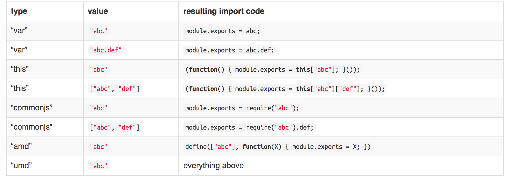

##1.webpack中的externals vs libraryTarget vs library

我们的目的只有一个，那就是编译script标签上的模块来使用。

下面的例子有两个条件：

1.我们的模块依赖于jQuery，但是我们不希望jQuery打包到最后的文件中去

2.我们的模块要存在于全局的变量Foo上面

webpack配置如下：

```js
module.exports = {
  entry: 
  {
    main:process.cwd()+'/example1/main.js',
  },
  output: {
    path:process.cwd()+'/dest/example1',
    filename: '[name].js',
    // export itself to a global var
    libraryTarget: "var",
    // name of the global var: "Foo"
    library: "Foo"
  },
    externals: {
        // require("jquery") is external and available
        //  on the global var jQuery
        "jquery": "jQuery"
    },
  plugins: [
   new CommonsChunkPlugin({
       name:"chunk",
       minChunks:2
   }),
    new  HtmlWebpackPlugin()
  ]
};
```

### 1.1 externals参数

其中external配置表示我们的模块中的require('jquery')中的jquery来自于window.jQuery，也就是来自于全局对象jQuery，而不要单独打包到我们的入口文件的bundle中，在页面中我们通过script标签来引入！

```js
 externals: {
        // require("jquery") is external and available
        //  on the global var jQuery
        "jquery": "jQuery"
    }
```

### 1.2 libraryTarget vs library

library:在output中配置，可以指定你的库的名称

libraryTarget:指定你的模块输出类型，可以是commonjs,AMD,script形式,UMD模式


例子1：

其中我们的libraryTarget设置为var,而library设置为'Foo'。也就是表示我们把入口文件打包的结果封装到遍历Foo上面(以下例子的external全部是一样的，见webpack.config.js文件)

```js
output: {
    path:process.cwd()+'/dest/example1',
    filename: '[name].js',
    // export itself to a global var
    libraryTarget: "var",
    // name of the global var: "Foo"
    library: "Foo"
  }
```

我们看看打包的结果：

```js
var Foo =
webpackJsonpFoo([0,1],[
/* 0 */
/***/ function(module, exports, __webpack_require__) {
  var jQuery = __webpack_require__(1);
  var math = __webpack_require__(2);
  function Foo() {}
  // ...
  module.exports = Foo;
/***/ },
/* 1 */
/***/ function(module, exports) {
       module.exports = jQuery
/***/ },
/* 2 */
/***/ function(module, exports) {

       console.log('main1');

/***/ }
]);
```

从结果分析我们的目的，我们的入口文件的bunle被打包成为一个变量，变量名就是library指定的Foo。而且我们externals中指定的jQuery也被打包成为一个模块，但是这个模块是没有jQuery源码的，他的模块内容很简单，就是引用window.jQuery：

```js
/* 1 */
/***/ function(module, exports) {
       module.exports = jQuery;
/***/ },
```


例子2：

修改webpack配置为:

```js
    libraryTarget: "commonjs",
  // name of the global var: "Foo"
    library: "Foo"
```

根据library，libraryTarget定义，我们知道打包结果如下:

```js
exports["Foo"] =
webpackJsonpFoo([0,1],[
/* 0 */
/***/ function(module, exports, __webpack_require__) {

  var jQuery = __webpack_require__(1);
  var math = __webpack_require__(2);
  function Foo() {}
     module.exports = Foo;
/***/ },
/* 1 */
/***/ function(module, exports) {
       module.exports = require("jQuery");
/***/ },
/* 2 */
/***/ function(module, exports) {
        console.log('main1');
/***/ }
]);
```

其中library指定的库的名称转化为exports["Foo"],!最后，很显然指定id为0的模块，也就是入口模块，最后得到的结果是符合commonjs规范的!

例子3：

修改webpack配置为:

```js
  // export itself to a global var
    libraryTarget: "amd",
  // name of the global var: "Foo"
    library: "Foo"
```

编译结果为:

```js
define("Foo", ["jQuery"], function(__WEBPACK_EXTERNAL_MODULE_1__) { 
  return webpackJsonpFoo([0,1],[
/* 0 */
/***/ function(module, exports, __webpack_require__) {
  var jQuery = __webpack_require__(1);
  // var math = require(["./main1.js",'./main2.js']);
  var math = __webpack_require__(2);
  function Foo() {}
  // ...
  module.exports = Foo;
/***/ },
/* 1 */
/***/ function(module, exports) {
       //jQuery加载由amd完成,其返回的是require('jQuery')后得到的结果
        module.exports = __WEBPACK_EXTERNAL_MODULE_1__;
/***/ },
/* 2 */
/***/ function(module, exports) {

  console.log('main1');

/***/ }
])});;
```

很显然是符合AMD规范的，第二个参数表示依赖的模块。jQuery被打包成为：

```js
/***/ function(module, exports) {
       //jQuery加载由amd完成
        module.exports = __WEBPACK_EXTERNAL_MODULE_1__;
/***/ }
```

而__WEBPACK_EXTERNAL_MODULE_1__指的就是jQuery，其加载有amd完成，直接require!

例子4：

webpack配置为:

```js
  libraryTarget: "this",
  // name of the global var: "Foo"
    library: "Foo"
```

打包结果为:

```js
this["Foo"] =
webpackJsonpFoo([0,1],[
/* 0 */
/***/ function(module, exports, __webpack_require__) {
  var jQuery = __webpack_require__(1);
  // var math = require(["./main1.js",'./main2.js']);
  var math = __webpack_require__(2);
  function Foo() {}

  // ...

  module.exports = Foo;
/***/ },
/* 1 */
/***/ function(module, exports) {

  (function() { module.exports = this["jQuery"]; }());

/***/ },
/* 2 */
/***/ function(module, exports) {

  console.log('main1');

/***/ }
]);
```

此时我们的library指定为this,我们的external指定的模块编译如下:

```js
/* 1 */
/***/ function(module, exports) {
     //this.jQuery和this.Foo
    (function() { module.exports = this["jQuery"]; }());
/***/ },
```


例子5：

webpack配置为:

```js
 libraryTarget: "umd",
  // name of the global var: "Foo"
    library: "Foo"
```

打包结果为:
```js

//接受到第一个参数为this(编译到this上)，第二个参数就是我们的一个函数，函数参数为__WEBPACK_EXTERNAL_MODULE_1__表示我们的jQuery模块
(function webpackUniversalModuleDefinition(root, factory) {
  //commonjs直接require
  if(typeof exports === 'object' && typeof module === 'object')
    module.exports = factory(require("jQuery"));
    //amd让define函数加载
  else if(typeof define === 'function' && define.amd)
    define(["jQuery"], factory);
    //cmd(require,jQuery的处理由cmd处理)，直接require
  else if(typeof exports === 'object')
    exports["Foo"] = factory(require("jQuery"));
  else
  //this
    root["Foo"] = factory(root["jQuery"]);
})(this, function(__WEBPACK_EXTERNAL_MODULE_1__) {
return webpackJsonpFoo([0,1],[
/* 0 */
/***/ function(module, exports, __webpack_require__) {

  var jQuery = __webpack_require__(1);
  // var math = require(["./main1.js",'./main2.js']);
  var math = __webpack_require__(2);
  function Foo() {}
  // ...
  module.exports = Foo;

/***/ },
/* 1 */
/***/ function(module, exports) {
        module.exports = __WEBPACK_EXTERNAL_MODULE_1__;
/***/ },
/* 2 */
/***/ function(module, exports) {

  console.log('main1');

/***/ }
])
});
;
```

注意，从上面的分析可以知道，我们除了将入口文件打包成为特定的模块以外，其external模块(require('jQuery'))也要进行处理的,external的key是require时候模块名称，value是我们在页面中通过script引入的文件名!

官方实例如下:

```js
{
    output: { libraryTarget: "commonjs" },
    externals: [
        {
            a: false, // a is not external
            b: true, // b is external `module.exports = b`
            "./c": "c", // "./c" is external `module.exports = c`
            "./d": "var d", // "./d" is external `module.exports = ./d`  <-- would be syntax error
                        "./f": "commonjs2 ./a/b", // "./f" is external `module.exports = require("./a/b")`
                        "./f": "commonjs ./a/b", // ...same as commonjs2
                        "./f": "this ./a/b" // "./f" is external `(function() { module.exports = this["./a/b"]; }())`
        },
        // Every non-relative module is external
        // abc -> require("abc")
        /^[a-z\-0-9]+$/,
        function(context, request, callback) {
            // Every module prefixed with "global-" becomes external
            // "global-abc" -> abc
            if(/^global-/.test(request))
                return callback(null, "var " + request.substr(7));
            callback();
        },
        "./e" // "./e" is external (require("./e"))
    ]
}
```

### 1.3 require数组情况




上图中我们还有很多种情况没有考虑到，如'abc.def',['abc','def']，我们按照上面的方式继续分析。

例子1：

其中我们的libraryTarget设置为var,而library设置为'Foo'。也就是表示我们把入口文件打包的结果封装到遍历Foo上面(以下例子的external全部是一样的，见webpack.config.js文件)

```js
output: {
    path:process.cwd()+'/dest/example1',
    filename: '[name].js',
    // export itself to a global var
    libraryTarget: "var",
    // name of the global var: "Foo"
    library: "Foo"
  }
```

其中main.js修改为如下:

```js
var jQuery = require("jquery");
var math = require(["./main1.js",'./main2.js']);
// var math = require("./main1.js");
function Foo() {}
// ...
module.exports = Foo;
```

我们看看打包的结果：

```js
var Foo =
webpackJsonpFoo([0,2],[
/* 0 */
/***/ function(module, exports, __webpack_require__) {
  var jQuery = __webpack_require__(1);
  var math = __webpack_require__.e/* require */(1, function() {[__webpack_require__(2),__webpack_require__(3)];});
  // var math = require("./main1.js");
  function Foo() {}
  // ...
  module.exports = Foo;
/***/ },
/* 1 */
/***/ function(module, exports) {

  module.exports = jQuery;

/***/ }
]);
```

大部分都是和上面一样的，只是这里多了一个__webpack_require__.e方法（见下面分析），其作用就是保证模块的加载顺序！因为这里的jQuery是external表示不要单独打包进来，而是直接使用script引入，所以这里的提前加载的id为1，其就是我们的jQuery!

```js
//提前加载external指定的jQuery，因为他是通过script直接引入，在其他模块中require
var math = __webpack_require__.e/* require */(1, function() {[__webpack_require__(2),__webpack_require__(3)];});
```

### 1.4 当require的是external中指定的数组或者'abc.def格式'

官网说明：

如果external指定为数组 ["abc", "def"],那么我们会打包成如下的格式:

```js
module.exports = require("abc").def;
```

也就相当于对于abc这个external文件，我们是通过script引入的，但是我们只会引入这个模块的def部分!

实际上：

main.js如下:

```js
var main1=require('abc');
var main1=require('def');
function Foo() {}

// ...
module.exports = Foo;

```

我们的webpack配置为如下：

```js
  externals:["abc", "def"],
```

我们require('abc')得到的结果是:

```js
exports["Foo"] =
webpackJsonpFoo([0,1],[
/* 0 */
/***/ function(module, exports, __webpack_require__) {
  var main1=__webpack_require__(1);
  var main1=__webpack_require__(2);
  function Foo() {}
  // ...

  module.exports = Foo;

/***/ },
/* 1 */
/***/ function(module, exports) {

  module.exports = require("abc");

/***/ },
/* 2 */
/***/ function(module, exports) {

  module.exports = require("def");

/***/ }
]);
```

此处结果暂时存疑，以后弄懂了会及时更新

##2. __webpack_require__.e方法分析

```js
/******/  __webpack_require__.e = function requireEnsure(chunkId, callback) {
/******/    // "0" is the signal for "already loaded"
            //0表示已经加载了这个模块，直接回调加载另外一个模块
            //这样可以保证我们的第一个参数的chunk是提前加载好的!
/******/    if(installedChunks[chunkId] === 0)
/******/      return callback.call(null, __webpack_require__);
/******/    // an array means "currently loading".
            //数组表示模块在加载中，这时候只是添加回调而已，所以回调可以是一个数组，但是
            //模块直接加载一次
/******/    if(installedChunks[chunkId] !== undefined) {
/******/      installedChunks[chunkId].push(callback);
/******/    } else {
/******/      // start chunk loading
             //开始加载模块
/******/      installedChunks[chunkId] = [callback];
/******/      var head = document.getElementsByTagName('head')[0];
/******/      var script = document.createElement('script');
/******/      script.type = 'text/javascript';
/******/      script.charset = 'utf-8';
/******/      script.async = true;
              //__webpack_require__.p = "";
/******/      script.src = __webpack_require__.p + "" + chunkId + "." + ({"0":"main"}[chunkId]||chunkId) + ".js";
              //直接通过chunId加载模块，文件名chunkId + "." + ({"0":"main"}[chunkId]||chunkId) + ".js"
/******/      head.appendChild(script);
/******/    }
/******/  };
```


参考资料：

[webpack官网](http://webpack.github.io/docs/configuration.html#externals)

[webpack中library和libraryTarget与externals的使用](https://github.com/zhengweikeng/blog/issues/10)
